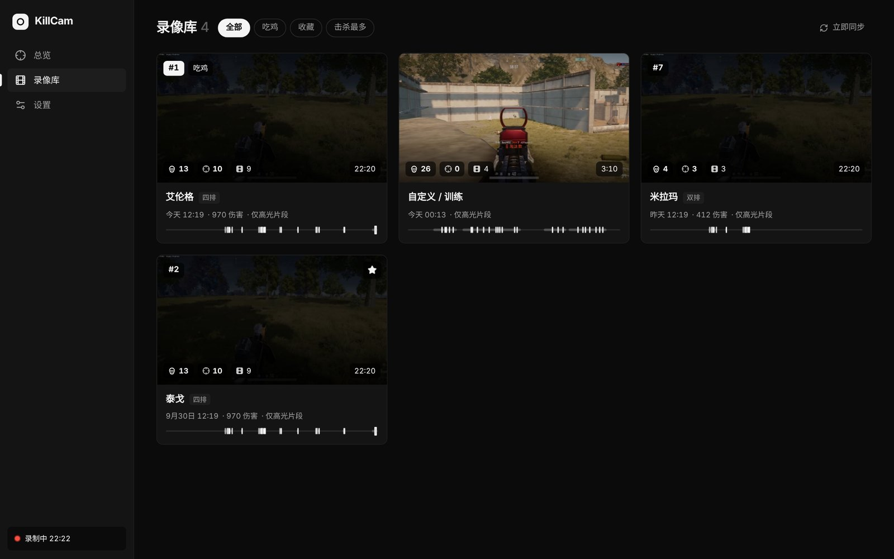
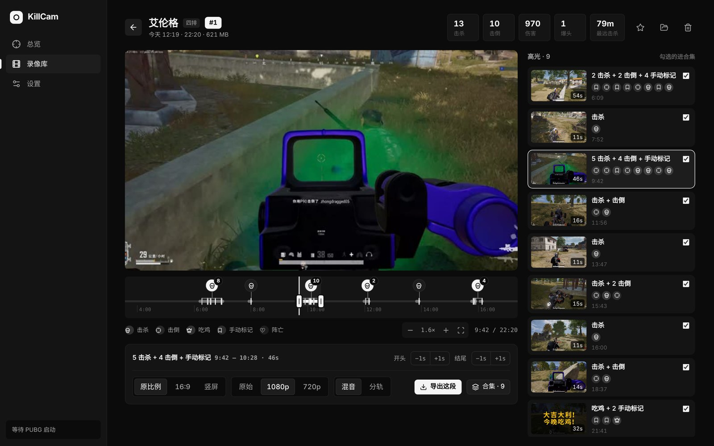
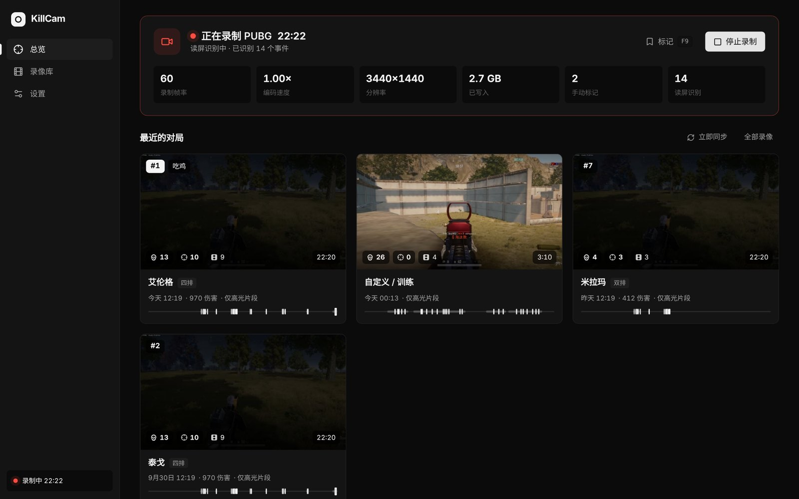
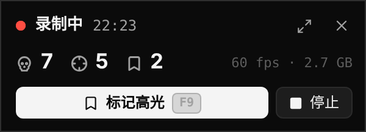

# KillCam

**免费、无广告的 PUBG / 英雄联盟自动高光录制。**
打开游戏就开始录，打完自动剪出击杀、多杀、吃鸡、胜利的片段。

[下载最新版](https://github.com/Jkeroromk/killcam/releases/latest) · [常见问题](#常见问题) · [反馈问题](https://github.com/Jkeroromk/killcam/issues)

## 能做什么

- **自动录制**：开机后待在托盘里，PUBG 一打开、英雄联盟一进对局就开始录，打完就停。不用记得按任何键。
- **英雄联盟**：击杀、双杀到五杀、一血、团灭、小龙先锋大龙（抢龙会标出来）、胜负，都来自游戏本身的实时数据，不用读屏，也不用 API Key；每局有英雄、KDA、补刀、伤害、金币和双方记分板。支持 Riot 客户端的各个服务器，暂不支持国服（WeGame）；回放和观战不录。
- **自动找高光**：边录边识别屏幕上的「淘汰数」「击倒了」「被击倒」「被淘汰」「大吉大利」提示；填了 PUBG API Key 的话，普通对局还会用官方数据精确标出每一次击杀、击倒和阵亡（武器、距离、是否爆头）。
- **一局一条记录**：地图、模式、排名、击杀、伤害一目了然。连着打几局也会自动分开，街机、自定义房间同样可以。
- **整局时间轴**：所有事件按时间排在一条可缩放的时间轴上，点哪看哪；太密集的击杀会自动合并，点一下放大。
- **个人数据**：PUBG 最近 20 / 50 局的场均击杀、K/D、场均伤害、吃鸡率、前十率、爆头率，每局击杀和伤害的走势，常用武器和各地图战绩（需要 PUBG API Key）；英雄联盟的胜率、KDA、分均补刀、场均伤害、多杀次数和常用英雄。
- **两个游戏分开管理**：录像库、数据、设置都用游戏图标切换；自动录制、保存方式、高光规则每个游戏单独设置。
- **剪辑导出**：每段高光都能拖动调整开头和结尾，导出原比例 / 16:9 / 竖屏，原画质 / 1080p / 720p；勾选几段一键合成集锦。
- **游戏声音和麦克风分开录**：导出时可以混在一起，也可以分轨，后期好处理。
- **F9 手动标记**：觉得刚才那波很精彩，按一下 F9，这一段就会被留下来。
- **游戏时的迷你窗口**：显示录制时长、识别到的击杀数，不会被录进视频里。
- **省空间**：可以只保留高光片段，整局录像处理完就删；超过设定的容量会自动清理最旧的录像（收藏的不删）。
- **自动更新**：有新版本时左下角会提示，点一下就装好。

<table>
<tr>
<td width="62%"></td>
<td>  </td>
</tr>
</table>

## 下载安装

1. 到 [Releases](https://github.com/Jkeroromk/killcam/releases/latest) 下载 `KillCam_x.x.x_x64-setup.exe`。
2. 双击安装。不需要管理员权限，FFmpeg 已经打包在里面，不用另外装。
3. 如果弹出 **「Windows 已保护你的电脑」**：点 **「更多信息」→「仍要运行」**。
   这是因为 KillCam 是免费的个人项目，还没有购买微软的代码签名证书。代码全部公开在这个仓库里，可以自己检查。
4. 第一次打开会有一个引导，带你选显示器、画质、声音来源、录像保存位置，最后跑一次性能测试确认不掉帧。

以后有新版本，KillCam 会自己提示，不用再来这里下载。

### 电脑要求

| | |
|---|---|
| 系统 | Windows 10（2004 及以上）或 Windows 11，64 位 |
| 显卡 | 支持 NVENC 的 NVIDIA 显卡（GTX 10 系列及以上）。AMD 显卡理论上可用，但还没测试过 |
| PUBG | Steam 版。读屏识别目前只支持**简体中文**游戏界面、默认 HUD |
| 英雄联盟 | Riot 客户端（各服务器都可以），暂不支持国服 WeGame |

## 常见问题

<b>会不会被封号？</b>

KillCam 不注入游戏、不读写游戏内存、不修改任何游戏文件。它用的方法和 OBS 的「显示器采集」一样：通过 Windows 自带的屏幕复制功能录屏，用 Windows 的音频接口录声音，PUBG 读的是游戏自己写在本地的日志文件和官方公开的 API；英雄联盟读的是游戏在你电脑上提供的数据接口：对局中是 Riot 开放给第三方工具的实时数据（Live Client Data），结算时从客户端读本局统计，都是只读。
不过反作弊的规则只有游戏公司说了算，这里没办法给出保证。

<b>会掉帧吗？</b>

录屏本身会占一点显卡，和开着 OBS 显示器采集差不多。编码用的是显卡上独立的 NVENC 芯片，不占玩游戏的算力。剪高光只复制视频数据、不重新编码，用最低优先级在后台跑，不会让游戏卡顿。
如果帧数比较紧张，可以在「设置 → 画质」里把录制帧率从 60 改成 30。

<b>需要 PUBG API Key 吗？</b>

不是必须的。不填的话，靠读屏识别击杀、击倒、阵亡和吃鸡，也能自动剪高光。
填了以后，普通对局会多出地图、排名、伤害、武器、距离、爆头等信息，时间点也更准。Key 可以在 [developer.pubg.com](https://developer.pubg.com/) 免费申请，引导里有步骤。

<b>打完多久能看到高光？</b>

不用关游戏：每局打完（吃鸡、被淘汰后一会儿，或者开始下一局时），这局的高光就会在后台剪好，回到大厅就能看。剪片段只是复制视频数据、不重新编码，用的是最低优先级，不影响游戏。填了 PUBG API Key 的话，普通对局会先按读屏剪好高光，标着「等官方数据」；几分钟后官方数据到了，会自动补上地图、排名、伤害和击杀详情，并按官方数据重新剪一次。

<b>迷你窗口看不到 / 挡住了游戏？</b>

迷你窗口不会被录进视频。游戏要用「无边框窗口」模式，它才能显示在游戏上面；用「全屏」模式的话它会被游戏挡住，有第二块屏幕可以把它拖过去，位置会被记住。不需要的话可以在「设置 → 启动和游戏时」关掉。

<b>录像和设置存在哪？怎么卸载？</b>

录像存在第一次引导时选的文件夹里，设置存在 `%APPDATA%\com.jkeroro.killcam`。
在 Windows「设置 → 应用」里卸载 KillCam 即可；录像文件夹不会被删除，需要的话自己删。

## 反馈

遇到问题或者有想要的功能，欢迎在 [Issues](https://github.com/Jkeroromk/killcam/issues) 里提。附上截图和大概发生的时间会更好查。

## 隐私与安全

- **不上传任何东西**：录像、截图、设置都只存在你自己电脑上，KillCam 没有服务器，也不收集使用数据。
- **只连这几个地方**：填了 API Key 时去 PUBG 官方接口查你自己的对局数据；英雄联盟第一次遇到某个英雄时，从 CommunityDragon 下载它的头像，之后存在本机；另外定期去本仓库的 Releases 检查有没有新版本。
- **API Key 只存在本机**：保存在你电脑的设置文件里，不会发给除 PUBG 官方以外的任何地方。
- **不碰游戏**：不注入游戏、不读写游戏内存、不修改游戏文件（见上面的[常见问题](#常见问题)）。
- **代码公开**：全部源代码都在这个仓库里，MIT 许可证，可以自己检查或编译。

## 许可证

[MIT](LICENSE)

KillCam 是个人项目，与 KRAFTON、PUBG 官方或 Riot Games 无关。

KillCam was created under Riot Games' "Legal Jibber Jabber" policy using assets owned by Riot Games. Riot Games does not endorse or sponsor this project.
